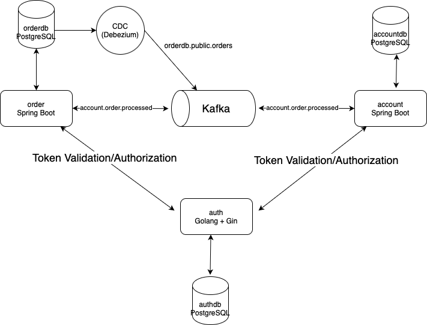

# oms-implementation

To be honest, I've written similar systems such as this one for over 5+ years now. I will rather explain the design
choices, the technology stack, the patterns used and some other miscellaneous topics in detail; but to summarize, this
project
is an Outbox Pattern implementation with highly distributed, event-driven architecture, orchestrated by Docker Compose.

Why did I pick this pattern? Well, to start with, the requirements on the lifecycle of an order (PENDING, MATCHED,
CANCELED) screamed event-sourcing,
hence I decided to go for microservices that fire and process events, without caring about synchronicity of the output
that much. As such,
when an Order is created (in PENDING state), the relevant microservice will just outsource an event, and after that the
corresponding microservice
will pick it up, process it, and then fire an event again.

I have three microservices:

1. account: handles asset creation, ie. depositing TRY or keeping track of existing assets. Written in Java22 +
   Spring-Boot + PostgreSQL + Apache Kafka
2. order: keeps track of orders, saving them to a database and updating their status. Written in Java22 + Spring-Boot +
   PostgreSQL + Apache Kafka + Debezium
3. auth: issues jwt tokens and makes authorizations. Only admin and customer roles are supported. Written with Go, gin
   and gorm.

There are a couple of things to explain here:

* The usage of go: I found jwt token management was not really at the scope of this project, but I needed it so that I
  can authenticate and authorize the endpoints.
  I find Go extremely pleasing language that offers very quick prototyping, hence the choice. I also had a similar
  system written in the past (you can refer to my [GitHub](https://github.com/mehmetcc?tab=repositories)
  page for that)
  so I just plugged it in and used it.
* The function of Debezium: I used Debezium for order only, because I needed eventual consistency guarantees for said
  service, since we have to be fast with fault tolerance of losing an event.
  The same can be said for account service as well, but speaking from experience, such OMS' systems usually has a
  CDC-like background task that intercepts dangling order processing, so I just
  fired an event after a transaction to the database happens.
  I could've integrated a DLQ, but now that I am thinking, this codebase had became rather large for a case interview so
  as such, I should mention that if a transaction to the account database
  fails, we record a faulty order (one in a million this could happen though) or if we don't publish to Kafka securely,
  we say bye bye to the order matching.

At the start of this, I actually had ambitions to integrate a real-time ticker as
well, [which I had written in the past](https://github.com/mehmetcc/pricer),
although then again, having interviewed people myself, I decided to spare the reader of this document from the agony of
reading thousands of lines of code. But having said that, I think this really is very close to a real life
production-ready OMS.

---

## Running

First of all, make sure you have a beefy machine, because this project will run a Kafka, a Zookeeper, 3 PostgreSQL's, 3
microservices, a Debezium, a curl engine to register configuration to Debezium, and a React application, called
Backoffice.

But then again, it is very easy to run this up:

```shell
docker compose up
```

I cannot emphasize having a strong machine to run this on enough. For example, Debezium is known to cause JVM stack
failures in case
of low memory. I've tested this on my M3 Apple Silicon. There might be some image issues in case of running this on
Windows
or Linux, so feel free to email me so that we can debug it further.

Again, this is a very resource-intensive project. It might hoggle up more than 8 gigs of RAM.

---

## System Design



---

### Happy Path

1. order creates a new order, writes it to the orderdb.
2. Debezium intercepts database change. Publishes an event to Kafka.
3. account picks it up: checks if whether the balance or the usable size is available for such a purchase. Fires an
   OrderProceedEvent.
4. order acknowledges the event. Changes the status of the Order to either MATCHED or CANCELLED, depending on the result
   published by account.

---

### Endpoints

#### Authentication Service (resides in port 668)

- **POST /register**  
  Registers a new user. The request payload should include the username, password, and role. A successful registration
  returns a confirmation message.

- **POST /login**  
  Authenticates a user using provided credentials (username and password). On success, it returns a JWT token used for
  authenticating subsequent requests.

- **GET /users**

  Retrieves a list of all registered users.

---

#### Order Service (resides in port 666)

- **POST /api/v1/orders**  
  Creates a new order.
    - **Admin users** can create orders on behalf of any customer.
    - **Regular users** are restricted to creating orders for themselves.

- **GET /api/v1/orders**  
  Retrieves a list of orders.
    - **Admin users** can query orders for any customer by providing a `customerId` parameter.
    - **Regular users** are limited to viewing only their own orders (if a `customerId` is provided, it must match the
      authenticated user's identifier).

- **DELETE /api/v1/orders**  
  Deletes an order specified by an `orderId` parameter.
    - **Admin users** can delete any order.
    - **Regular users** can delete only the orders that belong to them.

---

#### Account Service (resides in port 667)

- **POST /api/v1/assets**  
  Creates a new asset entry.
    - **Admin users** can create assets for any customer.
    - **Regular users** are allowed to create assets only for their own account.

- **GET /api/v1/assets**  
  Lists asset entries.
    - **Admin users** have access to view assets for any customer.
    - **Regular users** can only retrieve asset data associated with their own customer identifier.

---

## Testing

I advise testing the functionality by visiting http://localhost:669, where there is a Backoffice application. There, you
can
register a new user, make a deposit to users accounts, list available users, make a transaction, list past transactions,
and many much more. The app is designed as such so if you are an admin you are able to do and see everything and if you
are a customer you are just viewing your own account.

If you want to test by calling endpoints directly, you have to register a new user (by calling relevant auth
microservice endpoint) and making a deposit (by calling the relevant account microservice endpoint) You have to supply
bearer tokens as well.

There are also integration tests! Located under /integrationTests, you can run these node scripts one by one and see
what happens.

I've written Unit Tests for Service classes as well. I don't know the coverage, but I think you will enjoy reading them.
I also
tested JSON schemas, so that in case of schema changes the tests will just fail so the programmer will have to make
changes to keep the system up-to-date, per new schema.

---

## Observability

There are several facilities to check load and usage:

* [pgadmin4](http://localhost:8080)
* [kafka-ui](http://localhost:8081)

---

## Patterns used

System design patterns

* Event sourcing
* Outbox Pattern
* A-database-per-service
* Fire-and-forget events

Code-level design patterns:

* Builder
* Interpreter Pattern
* Tiered Architecture
* Hexagonal (DDD) Design -albeit under the Go project

---

## Usage of ChatGPT (or any other LLM)

I use LLM's extensively (also work on one during my day job) and since honesty is a virtue, I will be very forward
with the places I've used an LLM:

1. Dashboard creation. It is %80 percent the work of o4, I just did the styling.
2. Integration tests.
3. Dockerfile generation.
4. Documentation, mainly the ENDPOINTS.md

---

This was really fun. Distributed systems are amazing!

For further references on my open-source fintech projects, please refer to:

* [symbol-store](https://github.com/mehmetcc/symbol-store): a data store for prices. Go + TypeScript
* [pricer](https://github.com/mehmetcc/symbol-store): a price-api that fetches data from yfinance. Python + Postgres +
  websockets
* [file-streaming](https://github.com/mehmetcc/file-streaming): a data lake for prices fetched. Scala + ZIO + Tapir
* [stock-dashboard](https://github.com/mehmetcc/stock-dashboard): a dashboard for past price data. next.js + React +
  TypeScript
* [zio-ticker](https://github.com/mehmetcc/stock-dashboard): a rest-based ticker for calculating past statistics.
  Scala + ZIO + Tapir
* [candlesticks](https://github.com/mehmetcc/candlesticks): a Past challenge for TradeRepublic case interview, that
  calculates candlesticks. Postgres + Java + Spring-Boot
* [itsy-bitsy](https://github.com/mehmetcc/itsy-bitsy): a web crawler I use to crawl website data for sentiment
  analysis. Scala + ZIO + Tapir.
* [money](https://github.com/mehmetcc/money): an implementation of Money pattern. Rust.

I also have my own trading bot, although per SEC regulations you can't open source such a project.